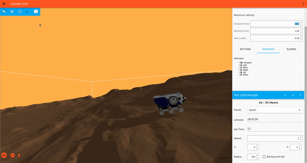
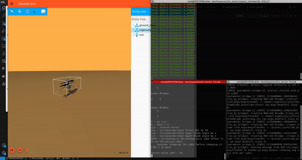

# NASA Space ROS Sim Summer Sprint Challenge

Team Lead Freelancer Username: @utkrishtjain

Submission Title: Custom Models & Gazebo Plugins for Realistic Simulations

## Description and Features

### Day Light Manager Plugin
The Sun is a crucial factor in driving most planetary processes, affecting nearly every environmental aspect either directly or indirectly. For realistic environmental simulations, accurately modeling the Sun's movement is vital, particularly in complex scenarios. The Daylight Manager plugin in Gazebo simulates the Sun's path based on the time of day and the observer's latitude, offering a dynamic and lifelike portrayal of sunlight. As the Sun's position changes, the shadows cast by objects and the background color also shift, as illustrated below.
> For detailed description of the plugin and it's usage, click [here](src/DayLightManager/README.md).


### Dust Manager Plugin
The Dust Manager plugin enables the simulation of realistic dust behavior in Martian or space environments by managing particle emitters. Dust plays a critical role in extraterrestrial settings, especially on Mars, where it can impact visibility, equipment functionality, and the overall success of missions. This plugin allows for precise simulation of dust clouds, supporting the development and testing of vehicles and systems intended for planetary exploration. By replicating how dust interacts with moving objects, it helps create more authentic and challenging scenarios for space missions. Additionally, the Dust Manager Plugin offers the ability to control wind conditions based on the parameters of dust storms incorporated into the simulation.
> For detailed description of the plugin and it's usage, click [here](src/DustManager/README.md).


### Car Dust Plugin
The Dust Emission Plugin simulates dust clouds generated by heavy vehicles moving across dusty terrains, such as the surfaces of Mars or the Moon. As vehicles traverse these environments, the plugin dynamically controls particle emitters to mimic realistic dust behavior, taking into account vehicle speed, surface texture, and atmospheric conditions. This enhances the accuracy of simulations for planetary exploration by providing lifelike interactions between vehicles and dust, aiding in the design and testing of exploration systems.

> For detailed description of the plugin and it's usage, click [here](src/VehicleDust/README.md)



### Drone Dust Plugin
The Drone Dust plugin simulates the dust clouds dispersed by a drone's thrusters during takeoff and landing in dusty environments, such as on Mars or the Moon. It dynamically controls particle emitters based on the drone's movement and thruster activity, creating realistic dust dispersion effects. This plugin helps in evaluating how dust affects the drone's performance and surrounding environment, enabling more accurate simulations for planetary exploration and vehicle testing.

> For detailed description of the plugin and it's usage, click [here](src/DroneDustPlugin/README.md)




### Real Surface Models
Custom models made from real elevation data (From NASA's Planetary Data System) of celestial bodies like Moon and Mars is also added.

- Model of Lunar Terrain made from elevation data LOLA on board the Lunar Reconnaissance Orbiter (LRO)

- Models of Martian Terrain made from elevation data from HiRISE Images on board the Mars Reconnaissance Orbiter (MRO)


## Build and Run

- Build the Custom Docker image with all the custom dependencies using the following command

```shell
./build.sh
```

- Once the Image has been build, use the following command to run the container

```shell
./run.sh
```
This will run the container where you can launch the simulation.
> If the container is running, you can use the same script/command in another terminal instance to attach a terminal into the docker.

- Once the docker container is up, you can use the demo launch file to launch the simualtion using the following command.

```shell
ros2 launch custom_gz_plugins demo_world.launch.py
```
> In order to user the GUI Plugin: DustManger or DayLightManger, use to menu option in the simulation (Top Right Corner) to load the plugin


